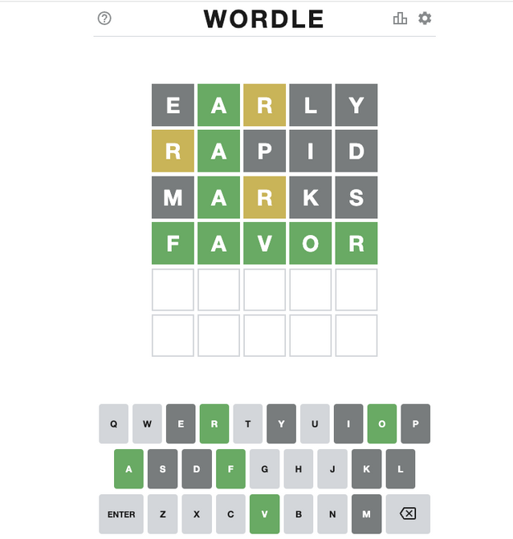
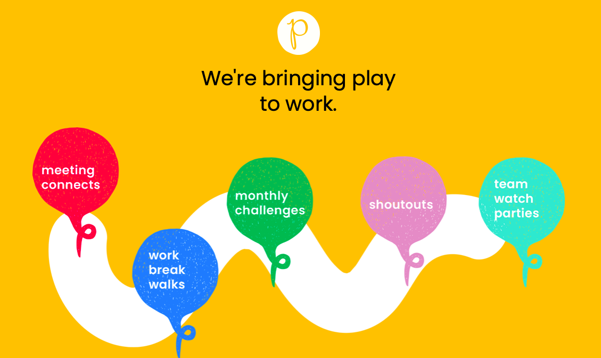

## Wordle 해보셨나요?
Wordle을 해보거나 들어보신 적이 있나요?
아니면 위와 같은 네모난 이모지 를 본 적이 있나요?
Wordle은 Josh Wardle라는 개발자가 만들어 인기를 끌고 있는 단어 맞추기 게임인데요,
행맨과 숫자야구를 합친 것 같은 규칙으로 진행됩니다.
아래 링크에서 바로 해볼 수 있습니다. 간단하지만 재밌어요.

https://www.powerlanguage.co.uk/wordle/

(하루에 한 단어씩 모두에게 같은 문제가 나오기 때문에 답을 공유하는 건 스포일러가 될 수 있습니다.)

게임을 재밌게 하다 보니 간단한 단어 맞추기 게임이니까 음성 인터페이스로 구현할 수 있지 않을까라는 생각이 들었습니다. 먼저 Wordle에 대해 분석해보고, 어떻게 인터페이스를 바꿔 구현할지, 어려운 것은 어떻게 해결할지 정리해보려고 해요. 당장은 상상만이지만 재밌지 않겠어요?

## Wordle은 어떤 게임인가?
규칙은 간단합니다. 5개 알파벳으로 된 단어를 입력하면 각각의 글자가 정답에 포함되었는지, 위치가 맞는지를 표시해줍니다. 글자, 위치가 맞으면 초록색, 위치만 다르면 노란색으로 나와요. 사전에 없는 단어는 입력할 수 없고, 알파벳이 중복해서 나올 수도 있습니다.

- 게임을 처음 시작하면 규칙을 보여줍니다.
- 게임 화면의 5*6 네모칸은 단어가 5개의 알파벳으로 구성되어 있으며, 6번의 기회가 있다는 것을 암시합니다.
- 하단의 키보드는 입력 가능한 알파벳을 보여줍니다
- 입력을 마친 뒤 Enter를 누르면 결과를 색으로 보여줍니다.
- 결과가 나오면 아래 키보드의 색도 바뀌게 됩니다. 다음에 입력할 때 도움이 되지요.
- 결과에 따라 틀린 알파벳을 빼고 맞는 알파벳과 다른 알파벳을 조합해 다음의 시도를 합니다.
- 사전에 없는 단어는 입력되지 않습니다. 알파벳 조합이 생각나지 않으면 틀린 알파벳을 하나 사용할 수밖에 없는 경우가 있어요.
- 6번째까지 맞추지 못하면 정답을 알려줍니다.

## Wordle을 음성 인터페이스만으로 구현할 수 있을까?
행맨이나 숫자야구는 종이와 펜을 쓰지만 기본적으로는 대화로 진행되는 게임입니다. Wordle도 비슷하게 할 수 있을 것 같아요. 화면이 있다면 좀 더 쉽게 할 수 있을 것 같은데 단어를 말하게 할지, 알파벳을 하나하나 말하게 할지 정도가 고민거리일 것 같습니다. 비슷한 발음, 우연을 이용한 입력 꼼수를 막으려면 알파벳으로 입력하도록 하는 게 맞을 것 같네요.

이번 목표는 화면이 없는 경우, 시각을 사용하지 않고 할 수 있는 게임을 만드는 것으로 정해보겠습니다. 그러면 다음의 문제를 해결해야 합니다.

- 말한 대로 입력이 되었는지에 대한 피드백
- 이전에 한 시도를 재인시켜주기
- 초록색, 노란색, 회색으로 표현되는 결과를 효과적으로 전달하기

### 입력 확인 피드백
>Wordle: "Welcome to Wordle. 알파벳 5개로 이루어진 단어를 맞춰보세요"
>User: "M, A, K, E, R"
>Wordle: "N, A, K, E, R. 진행할까요?"
>User: "아니야. M, A, K, E, R"

*사실 Y/N 대답과 다음 발화를 붙여 진행하는 것은 문제가 생기기 쉬운 방법입니다. 단계를 구분해서 진행하도록 만드는 것이 실제 서비스를 만드는 데는 좀 더 맞는 방법입니다. 하지만 사용자들은 이렇게 말하는 경우가 많아요.

### 이전의 시도 재인시켜주기
>User: "C, R, E, A, M"
>Wordle: "C, R, E, A, M. C는 틀린 알파벳이에요. 이대로 입력하시나요?"
>User: "그래."

*세 번째 시도부터는 어떤 것을 말했는지 기억하기 힘들어집니다. 단기 기억력이 좋더라도 인지부하를 발생시키는 부분이니까 괜히 사용자에게 스트레스를 줄 필요는 없습니다. 단어를 떠올리는 스트레스 정도가 게임의 재미를 주는 부분이니까요. 부하는 가능한 시스템이 짊어지도록 한다는 것을 항상 기억해야 합니다.

>User: "Y, A, C, H, T"
>Wordle: "Y, A, C, H, T. 진행할까요?"
>User: "그래."
>Wordle: "Y, A, C, H, T"

가장 고민되는 부분입니다. 결과를 목소리 톤을 바꿔가며 읽어주면 될까요? 각 결과마다 다른 목소리로 읽어주면 어떨까요?

- 초록: 밝고 쾌활한 톤
- 노랑: 진중한, 평이한 톤
- 검정: 힘없는, 슬픈 톤

한번 말해주는 것으로는 부족할까요? 한번 더 정리해주면 어떨까요? 초록, 노랑 알파벳이 중요하니까 이것만 요약해서 들려줍니다.

>Wordle: "Y가 맞았어요, A랑 T는 위치가 틀렸네요"

음성으로 하려면 난이도가 높아지니 알파벳 수를 4개로 줄여야 할지도 모르겠습니다. 기존 게임과 같은 형태를 인터페이스만 바꿔서는 좋은 결과가 나오기는 어렵다고 생각합니다. 다음에는 이미 서비스되고 있는 게임을 한번 살펴보려고 합니다.

## 음성으로 동작하는 게임들
기술의 발전과 활성을 이끄는 데에는 게임(콘텐츠)이 중요한 역할을 합니다. 음성 게임 스튜디오 Labworks.io 설립자 Tom Hewitson에 따르면 2019년에 17개국에서 8백만이 넘는 사람이 자신들의 음성 게임을 플레이했다고 하네요. 음성으로 동작하는 게임 몇 개를 소개해봅니다.

### Voice Arcade

음성 게임 스튜디오 Labworks.io의 게임 플랫폼 Voice Arcade
Alexa에게 ‘open, Voice Arcade’라고 말하여 플레이할 수 있다고 하네요. 매일 제한 시간 동안 무료 게임을 할 수 있고 월 구독 무제한 플랜이 있습니다. 여러 게임들 중 "Star Commander"는 아마존 어워드 후보에도 올랐던 게임이라고 하는데 선택을 하면서 이어가는 스토리텔링 게임이라고 합니다. 

### Piffle

Google for Startups Accelerator: Voice AI 프로그램의 'Piffle'
아직 베타 서비스를 준비 중입니다. 정보가 많지는 않은데 대화형 게임을 통해 건강한 환경 업무 문화와 직장을 만드는 것을 추구한다고 합니다. 자기 계발을 위한 콘텐츠를 대화형 게임으로 풀어내는 것을 목표로 하고 있다고 해요. 잠깐 '면접에서 살아남기 게임'을 서비스했고 '어색한 상황 극복하기' 스타트업 창업자가 되어 '투자금이 바닥나기 전에 성공시키기' 게임을 소개했었습니다. 서비스 전까지 많은 변화가 있을 것 같네요.

### Pac-Man Waka Waka

Doppio Games의 음성 버전 팩맨 Pac-Man Waka Waka
알렉사가 동작하는 스마트 디스플레이에서 구동 가능하다고 하네요. Waka, Waki, Wiki, Wika라고 말해서 좌우상하로 조작한다고 하는데요, 유튜브에 

## 압도적으로 긍정적
위의 Doppio Games에서 만든 [단어 맞추기 게임](https://www.youtube.com/watch?v=4QxxYTorhVI)(Zoom에서 하는), 소리를 질러 조종하는 플래피버드 게임 등등 다양한 시도를 쉽게 찾을 수 있습니다. 왠지 PC통신 시절에 머드(multi user dungeon, MUD) 게임을 하던 시절 같아요. 초창기라는 거죠. 어디까지 발전할 수 있을지는 모르겠지만 멋진 게임이 등장했으면 좋겠어요. VR기기도 한계가 있어 보였는데 어느새 압도적으로 호평하는 게임이 나오기도 했잖아요. 목소리로 마법을 영창 하고 톤에 따라 속성이 달라지는 그런 시스템도 가능하지 않을까요. 

>죽은척하기!