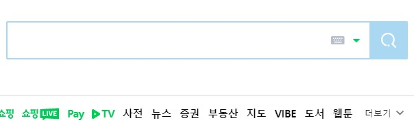

미리 말씀드리지만 이 글에 답은 없습니다. 고민하던 것을 한번 남기고 나중에 다시 돌아보려고 합니다.

최근 몸담고 있는 프로젝트에서 시각장애인을 고려한 UI를 개발하고 있습니다. '음성을 사용하는 대화형 UI'를 디자인해왔으니 좋은 기회라고 생각했어요. 대화를 중심으로 풀어나가는 UI를 설계하고 화면을 보조적인 수단으로 사용하면 시각 사용 여부와 상관없이 받아들여질 수 있는 결과물이 나올 것이라고 생각했거든요. 하지만 역시 실제로는 해결해야 할 많은 문제들이 있었습니다. 그 중 하나가 이번에 말해볼 '더보기'문제입니다.

## '보기'라는 표현을 써도 될까요?
많은 프로덕트에서 사용하는 UI 문법 중 흔히 볼 수 있는 것 중 하나가 '더보기>' 인데요. 선택지가 많을 때, 그리고 그 위계를 정할 수 있을 때 자주 사용하지 않는 선택지를 접어 간결하게 표현하고는 합니다.

### 찬성🙆‍♂️

네이버 메인화면의 '더보기' 버튼 스크린샷

개발하는 기능이 효과적으로 기능하느냐 하는 기준으로 보았을 때 이미 많이 사용되고 있는 방법을 따르는 것은 큰 장점을 갖습니다. 프로젝트 중 만났던 시각장애인이 '보인다'는 표현을 사용하는 것을 인상깊게 들었던 기억이 있는데요. 관용적으로 사용하는 표현이므로 그 기능을 알 수 있도록 하는데 무리가 없을 것이라는 생각이 듭니다.

Apple iOS16 소개 페이지의 '더 알아보기' 스크린샷

한편 위와같이 '더 알아보기'라는 표현은 '보기'라는 말이 들어가지만 시각적인 의미보다는 시도해본다는 의미로도 사용됩니다. 다만 선택지를 보여줄 때 어울리는 표현은 아니었습니다.

### 반대🙅‍♂️
처음 드는 생각은 더보기라는 표현에 녹아있는 일반인의 '본다'는 개념입니다. 숨겨져있던 것을 보이게 바꾼다는 의미로 사용되므로 시각적인 의미를 포함하고 있습니다. 다른 대안으로 생각했던 '펼치기/접기'도 보여지는 형태를 사용하고 있었습니다. 

그리고 앞서 말씀드렸듯이 '대화형UI' 라는 컨셉에서는 어색한 문구이기도 합니다. 대화로 풀어보면 다음과 같을 것입니다. 

>System  화자: 가, 나, 다, 라 중 어떤것인가요?
>사용자: 어.. 없어요. 다른건 없나요?
>System  화자: 그럼 마, 바, 사, 아, 자, 차, 카, 타, 파, 하 중에서는 어떤것인가요?
>사용자: '카' 에요

더 고민해보면 좀 더 자연스러운 대화가 되는 UI와 문구를 만들어낼 수 있지 않을까요?