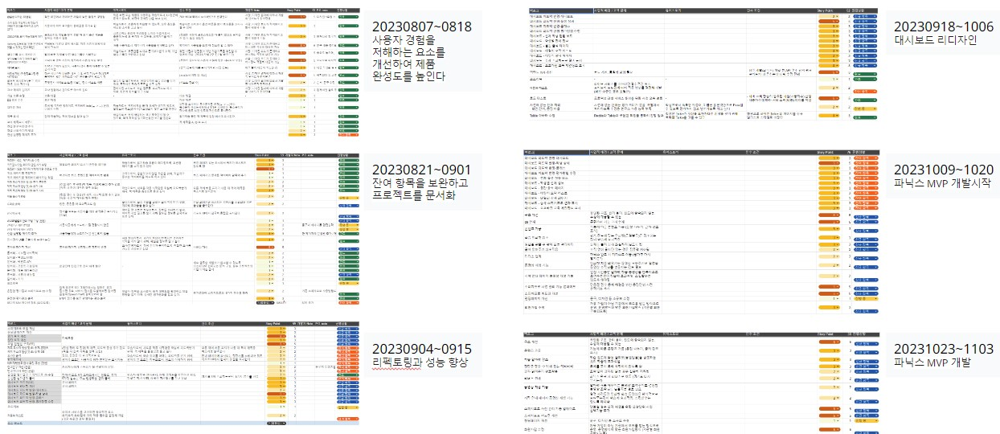
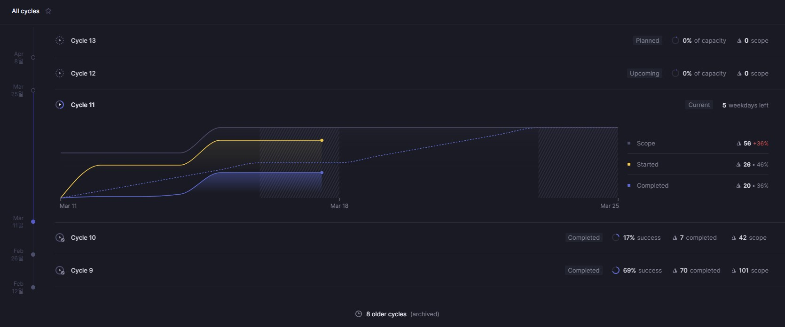

>2023년은 팀이 붕괴되는 와중에도 프로젝트를 이끌어간 해였습니다. 조직 개편과 동료들의 연이은 퇴사로 인해 혼란스러운 상황에서도, 어린이 영어 교육 서비스를 성공적으로 출시하기까지의 여정입니다. 불확실한 환경 속에서 우리 팀이 어떻게 프로젝트를 수행했는지, 그리고 이 과정에서 얻은 교훈들에 대해 기록합니다.

## 프로젝트 시작과 초기 도전
2023년 1월, 발음 평가 기술을 어린이 영어 교육에 활용하는 서비스를 출시하는 프로젝트가 시작되었습니다. 저는 디자인 팀을 이끌고 UI디자인과 UX기획에 참여했고, 발음 평가 모델을 개발한 팀과 앱 개발 팀이 프로젝트 팀으로 함께했습니다. 2월 중 기획방향이 결정되고, 3월에 베타버전이 경영진에 보고되었습니다. 시니어 개발자 없이 긴급하게 진행되는 불안함이 남아있었으나 부족한 경험은 기술블로그를 운영하며 스터디를 병행하고, 스크럼을 도입하며 JIRA로 관리하는 프로세스를 정착시키기 위해 노력했습니다. 하지만 이 과정에서 대대적인 조직개편과 연이은 각 소속 팀에서 팀원들의 퇴사로 혼란스러운 상황에 놓였습니다. 

## 중반의 위기와 변화
4월 프로젝트 팀은 하나의 공식 팀으로 모이게 되었고 저는 이 팀에서 유일한 디자이너로 참여하게 되었습니다. 혼란스러운 와중에 어럽게 만들어진 팀이었지만 새로운 자체 서비스를 만든다는 목표를 가지고 팀원 모두 열정적으로 업무에 임했습니다. 하지만 6월이 지나도록 프로젝트 완료가 되지 않고, 과중되는 부가 프로젝트로 건강 문제를 겪으며 팀장이 퇴사를 결정하면서 위기를 맞이하게 됩니다.

## 새로운 리더로 거듭나기
팀장 퇴사 후 업무 인수인계를 받고 임시로 프로젝트 리더를 맡게 되었습니다. 달라진 포지션을 담당하면서 더 커진 책임을 지어야 했습니다. 우선은 프로젝트가 무너지지 않도록 팀을 재정비하는데 노력을 기울였습니다. 남은 팀원과 1on1을 진행했으며, 불안을 가지고 있지만 현재 프로덕트를 개발하는데 각자 애정을 갖고 자부심을 느끼고 있음을 확인했습니다.

팀은 우선 사기가 매우 낮아진 상황이었습니다. 조직개편으로 인한 팀 해체를 극복하고 무언가 해보려고 했지만 이어지는 팀원의 퇴사로 다시 의욕이 떨어지는 경험이 반복되었습니다. 팀장 퇴사 이후 지금까지 얻은것을 바탕으로 더 나은 곳으로 가자는 것이 공유된 생각이었고, 아마 모두가 이직을 생각하고 있었을 것입니다. 개인적으로는 서비스 출시까지가 적어도 얻어야 하는 최소한의 경험이라고 판단하여 프로젝트의 끝은 보는 것을 목표로 팀에 잔류하기를 결정하였습니다.

## 변화의 기회 찾아내기
혼란스러운 와중에 구성된 팀이었으나 이를 기회로 삼아 하고싶은 것을 다 해보자는 분위기는 유지해나가고 싶은 장점이었습니다. 팀원 한명의 제안으로 스크럼을 도입하기로 하였고 각자 스터디하여 일부 형식을 도입했습니다. 이때 [유저 스토리](../2023-09-24-유저-스토리/index.md)에 대해 다시 공부하고 내용을 공유했습니다. 애자일 개념은 일하기 시작할 때부터 알고 있었지만, 실제 업무에서 어려움을 겪은 경험을 통해 이번 기회에 새롭게 발견할 수 있었는데요, 많은 문제를 해소할 방법을 찾아냈습니다.

### 지금 좋지 않더라도 좋아진다는 기대, 이미 좋은 곳에 있는 것처럼 행동하기
좀 더 나은 환경에서 일하고 성과를 인정받고 싶은 마음은 같지만 이것을 바로 줄 수 있는 상황은 아니었습니다. 그럼에도 불구하고 바로 할 수있는 것들은 있었습니다. 변화를 기다리지 않고 이미 변화한 것처럼 행동하는 것입니다. 예를들어 애자일 프로세스 하는 회사에서 일해보고 싶다는 마음은 애자일 프로세스를 실행하는 것으로 달성될 수 있습니다. 잘 모르고 어색한 부분은 조정해나가면서요.

### 해결 방법: 스크럼 제대로 해보기. 그리고 배운 것
원래 하려던 방향은 맞다고 생각했습니다. 여건상 제대로 이루어질 수 없었던 것 뿐이었지요. 숨을 고르고 목표를 이룰 수 있는 환경을 만들어보고자 했습니다.

- 장기 계획을 의미있게 설계하기 어려운 환경이므로 단기 목표를 세우고 수정할 수 있는 구조 적용 → 2주 주기 목표 설정 및 개발, 수정 프로세스 도입
- 데일리미팅 도입: 매일 무엇을 개발하고 이슈가 무엇인지 짧은 회의를 통해 하루 10분 이내로 상황 공유, 개발 진척상황을 가시화
- 개발 목표는 모두가 공유할수 있는 언어로 정리
- 2주기 개발 결과 소통, 피드백으로 지속적 수정
- 팀장은 없으나 P.O. 포지션을 맡아 개발 지속될 수 있도록 함
- 팀원간 코드리뷰를 지속하여 팀원간 스타일 차이를 줄이고 소통 활성화
- 팀원간 스터디 및 전파 장려 (생산성 향상 기술 도입)
- 외부 인력 활용-도서관 교육 전문가 섭외 테스트 → 사용자관점 테스트 → P.O. 의견 정제하여 목표에 맞는 우선순위 이슈 전달

JIRA의 태스크에 너무 많은 다른 작업이 포함되어 있고 이슈가 통합관리되지 않아 전체적인 정리가 필요했다.
또 작업을 정리하고 결과를 보고하는데 추가적인 업무가 발생했다
자동화된 관리도구 도입을 고려할 시점 ⭢ Linear.app 도입

주기에 따라 업무를 자동 관리하고, 진척도 그래프와 프로젝트 예측이 이루어져 적합한 개발 속도를 찾아나가는 데 도움이 되었습니다.

## 결론
물론 이 모든 과정을 거치며 교훈을 얻는 과정에서도 팀은 여전히 무너지고 있었고, 12월부터 팀을 리빌딩하여 현재 출시를 앞두고 있습니다. 혼란스러운 상황에서도 프로젝트 자체가 취소되지 않은 것은 회사의 방침에 큰 도움을 받은 것도 사실이지만, 내부적으로 팀에서 노력한 것이 없었다면 그 무엇도 할 수 없었을 것이라고 생각합니다.

그리고 개인적으로 성장한 부분도 있습니다. 이전에는 디자이너로서 내 파트의 일을 탁월하게 해내는 것에 자부심이 있었습니다. 혼란스럽더라도 많은 가능성과 모호함을 끌어안고 최고의 답을 내놓는 것을 목표로 했습니다. 하지만 이번 경험을 통해 일을 잘 하려는 사람이 모여 오히려 일의 완성을 방해하는 현상을 경험했습니다. 일을 되도록 하는, 좀 더 멀리서 보는 시각을 배우게 되는 계기가 되었습니다.

또 목표가 명확하고 충분히 공유되어야 한다는 점도 다시한번 배웠습니다. 적절한 시점에 구체적인 목표가 선언되고 팀원과 공유되어야 하며, 공유된 이후라도 끊임없이 소통해 이해를 맞춰나가야 한다는 것이었습니다. 특히 스크럼을 도입하고 다시 정비하는 과정에서 중요하게 생각한 데일리 미팅은 생각보다 더 많은 소통을 만들어냈고, 잠깐의 시간으로 매우 효과적인 이득을 얻을 수 있다는 것을 배웠습니다.