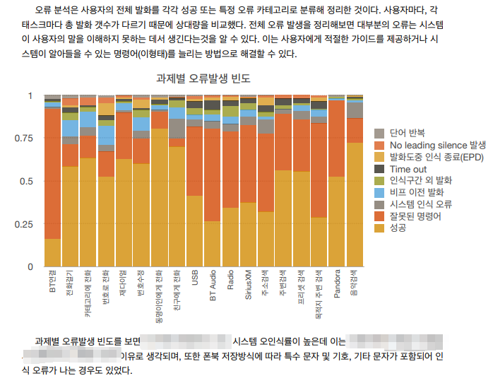

```
📅기간: 2013/11/15 ⭢ 2014/04/30
🤝고객: 현대자동차
🖥️업무: UX 리서치
🎯기여도: 20%
```

## 💡 프로젝트 목표
120명의 북미 사용자 대상 3개 차종 사용성 조사 및 벤치마킹
- 고객 불만 요소 및 개선 사항 도출
- 잠재적 고객 요구사항 도출
- 접근성 및 전반적인 UX개선 사항 도출

## 💡 접근 방법
- Task 기반 Usability Test
- TCR/TCT/Satisfaction Score
- 사용자 행동 분석
- 심층 인터뷰
- Eye tracking
- 명령어 정보 구조 평가

## 💡 결과
다음의 질문에 대한 답변 또는 제안이 포함된 보고서 제출

- 3개 차종 시스템 분석 비교
- 오류 분석
- 발화패턴 분석
- 아이트래킹 장비 사용한 태스크별 분석

### 보고서 샘플
#### 오류분석


#### 대분류 과제별 수행 능력과 만족도
