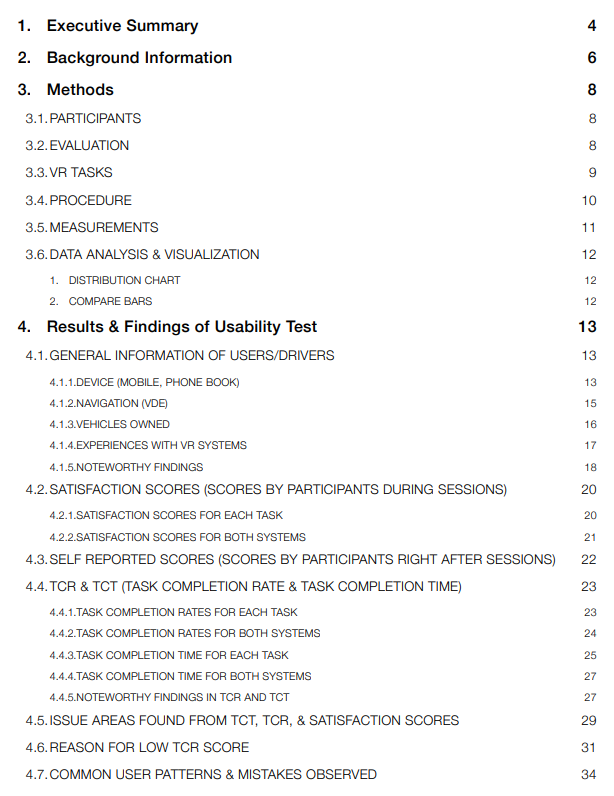

```
📅기간: 2015/07/01 ⭢ 2015/09/01
🤝고객: TOYOTA
🖥️업무: UX 리서치
🎯기여도: 20%
```

## 💡 프로젝트 목표
2개 차종의 음성 시스템을 분석하고 IQS(Initial Quality Study, 초기품질지수) 점수 개선을 위한 제안

## 💡 접근 방법
- Federal Highway Administration (FHWA)보고서를 기준으로 북미 운전자를 대표할 수 있는 14명의 참가자 집단을 섭외하고 태스크 기반 사용성 조사 및 인터뷰, 전문가 휴리스틱 평가를 진행했습니다.

- 참가자 수가 적어 통계적으로 유의한 결과가 나오기는 어렵기 때문에, 수치는 보조적으로 사용하고 사용자 관찰 및 심층 인터뷰 결과를 통해 인사이트를 도출하는 방법을 사용했습니다.

## 💡 결과
다음의 제안이 포함된 보고서 제출

- Weak areas that make users confused and lower usability.
- BT connection issues are treated separately by a different engineering group at OEMs or 1st tiers. but users consider that problem as a part of VR implementation problems.
Recommends improvement in VUI scenario, prompts, on-screen help tips, timing of beep, and software system stability.
- Recommend setting up soon a task force team that focuses on tests and improvement for semi-annual IQS events.

### 보고서 샘플
#### TABLE OF CONTENTS
