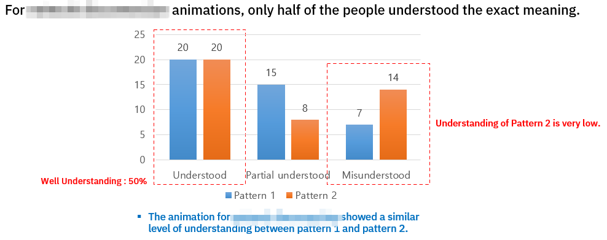

```
📅기간: 2018/06/01 ⭢ 2018/09/30
🤝고객: Honda
🖥️업무: UX 리서치
🎯기여도: 20%
```

## 💡 프로젝트 목표
신규 어시스턴트 시스템과 캐릭터 애니메이션 적합성 연구

Main goal:
1. Can customers accept the character design?
2. Can customers understand the speech recognition status by the animation?
3. Matching of the character name and character design.
4. Target response time is acceptable for customers or not.

## 💡 접근 방법
개발단계의 음성 서비스를 테스트하기 위해 WoZ테스트를 진행했습니다. 일반적으로 음성 인터페이스에서 추상적인 애니메이션을 사용하는것과 달리 단순화된 캐릭터를 사용하는 시스템을 국가별로 테스트하는 것이 목표로, 참가자의 모국어, 진행에 참여한 통역자간 차이를 줄이기 위해 진행 가이드를 정비하는 것이 중요한 과제였습니다.

가능한 이미지를 활용하여 진행하였고 인터뷰 내용은 키워드를 활용해 비교했습니다.

## 💡 결과
다음의 질문에 대한 답변 또는 제안이 포함된 보고서 제출
1. 애니메이션 타입 별 효과성 비교
2. 캐릭터에 대한 전반적 인상, 국가별 비교
3. 애니메이션 타입 별 레이블 적절성 비교

### 보고서 샘플
#### 애니메이션 패턴의 이해도 비교 분석
