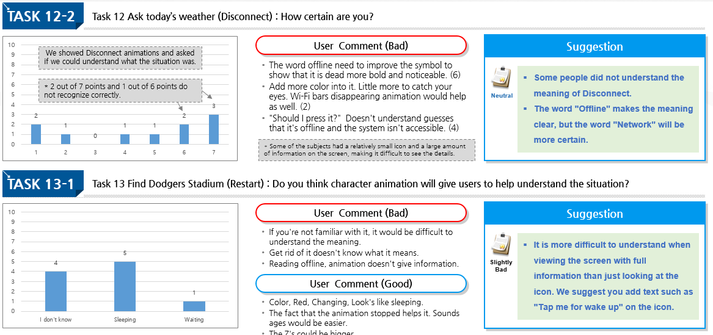

```
📅기간: 2018/11/01 ⭢ 2018/12/31
🤝고객: Honda
🖥️업무: UX 리서치
🎯기여도: 20%
```

## 💡 프로젝트 목표
신규 어시스턴트 시스템과 캐릭터 애니메이션 적합성 연구

Main goal:
- Understanding the meaning of character
- User acceptance of response time
- Check how much better than Step1 result
- Analysis for the Task Completion Rate, Length of Voice Prompt, Screen display

## 💡 접근 방법
개발단계의 음성 서비스를 테스트하기 위해 WoZ테스트를 진행했습니다. 일반적으로 음성 인터페이스에서 추상적인 애니메이션을 사용하는것과 달리 단순화된 캐릭터를 사용하는 시스템을 국가별로 테스트하는 것이 목표였습니다. 이전 테스트에 이어 미국 현지에서 원어민을 대상으로 테스트했습니다.

## 💡 결과
다음의 질문에 대한 답변 또는 제안이 포함된 보고서 제출
- Not enough information regarding basic usage on display.
- The icon / symbol is still hard to read. Clarification needed.
- Certain GUI parts that cause confusion need to be improved.

### 보고서 샘플
#### 애니메이션 패턴의 이해도 분석
