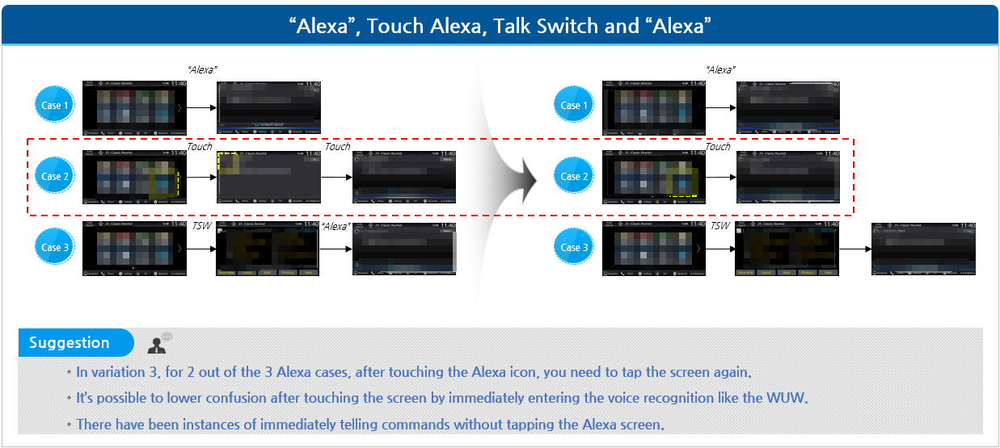

```
📅기간: 2018/11/01 ⭢ 2018/12/31
🤝고객: Honda
🖥️업무: UX 리서치
🎯기여도: 20%
```

## 💡 프로젝트 목표
다중 음성 어시스턴트 적용 연구

Main goal:
- UX test for Embedded SR
- UX test with embedded SR and Agent AI
- UX test with Embedded SR, Agent AI, and Alexa combined tasks.

## 💡 접근 방법
- 하나의 시스템에서 여러 개의 음성 인식 서비스를 제공하면 사용자가 혼란스러워 할 것임
- 이런 시스템에서 수행할 테스트에는 다음과 같습니다.
    - 사용자의 혼란에 어떤 영향을 미칠 것인가?
    - 언제 / 어디에서 사용자가 혼란스러워 하는가?
- 요구사항의 테스트 방식은 사용자 행동을 제한하기 때문에 '자연스러운 사용자'와는 거리가 멀다는 문제점이 있습니다.
- 테스트하고 싶은 모든 기능을 열어두고 주어진 상황에서 사용자가 어떻게 행동해 목적을 달성하는지 조사를 선행합니다.

## 💡 결과
다음의 제안이 포함된 보고서 제출
- Embedded 음성인식 서비스 개선방안
- Embedded 음성인식 서비스와 온라인 AI 에이전트 서비스의 조합 시 발생하는 문제점과 개선방안
- 조합에 Alexa 음성 인터페이스가 추가되었을 때 발생하는 문제점과 개선방안

### 보고서 샘플
#### 다중 에이전트 제공 상황에서 사용자 행동 분석

 AI 에이전트나 Alexa가 비활성화 상태일 때 사용자가 해당 기능을 시도하려 할 경우, 더 명확하고 직관적인 유도 메시지와 대안적인 조작 방법을 제공해야 합니다. 예를 들어, Alexa 아이콘을 탭했을 때 연결이 되지 않는 상황을 감지하면, 사용자에게 시스템의 기본 음성 인터페이스(Embedded SR)로 전환하도록 안내하는 팝업 메시지를 바로 표시합니다.