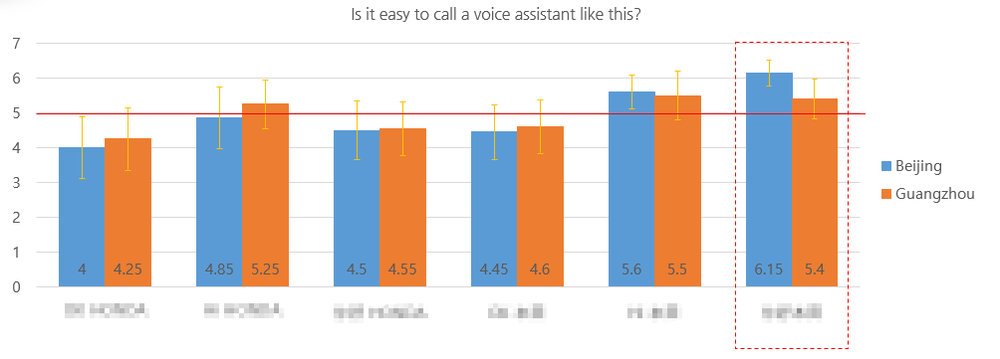
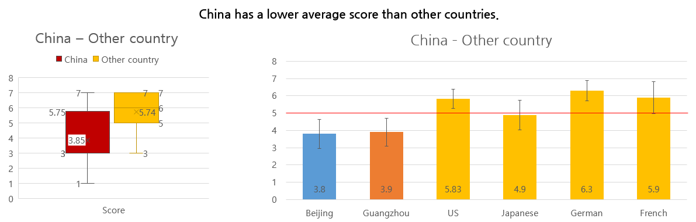
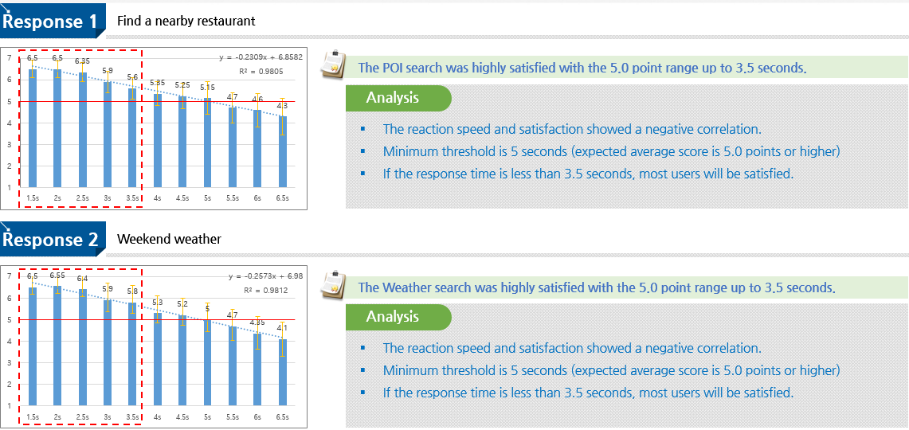

```
📅기간: 2019-05-07 ⭢ 2019-07-10
🤝고객: Honda
🖥️업무: UX 리서치
🎯기여도: 30%
```

## 💡 프로젝트 목표
다중 음성 어시스턴트 적용 연구

- Test whether the customer can accept character design
- Test whether the customer can understand the speech recognition state by animation.
- Test whether the customer can accept the wake-up word "OK HONDA".
- Find insights that make it easier for customers to take on the character/wake-up word.

## 💡 접근 방법
처음으로 중국에서 진행한 사용자 인터뷰 입니다. 대상 그룹이 A/B 테스트를 할 만큼 충분히 많지는 않았기 때문에, 개별 인터뷰와 관찰을 통해 인사이트를 얻고자 했습니다. 중간에 통역이 끼어서 진행할 수밖에 없었기 때문에 소통에 시간이 소요되고 충분히 의사를 전달하기 어려운 점을 보완하기 위해 테스트 진행 가이드를 신중하게 만들고 현지 어시스턴트를 충분히 교육했습니다.

## 💡 결과
대상 브랜드의 인지도가 낮고 영어를 잘 사용하지 않는 특징이 있었습니다. 중국 사용자들은 브랜드명을 고유명사가 아닌 글자 그대로 읽고, Wake up word(호출어)에서 익숙하게 사용하는 Hello, OK 등은 어색하거나 선호되지 않는 모습을 보였습니다.

다음의 내용이 포함된 보고서 제출
- 음성 서비스 경험 기초조사
- 캐릭터 선호 유형 분석
- 브랜드 이해도와 독음 방법 조사
- Wake Up Word(호출어) 적합성 조사
- 어시스턴트 애니메이션 적합성 조사
- 어시스턴트 감정표현 적합성 조사

### 보고서 샘플
#### Is it easy to call a voice assistant like this?

#### What do you think of the impression of voice assistant?

#### Time threshold determination
