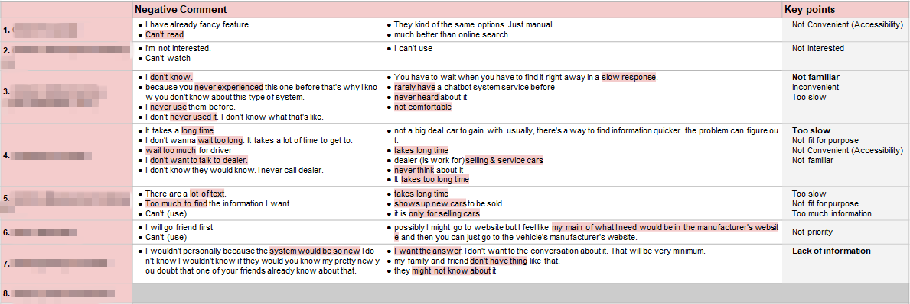

```
📅기간: 2019-11-18 ⭢ 2019-12-13
🤝고객: Honda
🖥️업무: UX 리서치
🎯기여도: 30%
```

## 💡 프로젝트 목표
ADAS 시스템을 설명하는 대화형 인터랙티브 메뉴얼의 효용성과 편의성 조사

## 💡 접근 방법
데모 앱과 테스트용 하드웨어 구성해 WoZ 테스트를 진행했습니다. 전방의 대형 스크린에 주행 시뮬레이션을 보여주고, 참가자의 앞에 있는 스티어링 휠로 조작합니다. 기능키를 사용해 차량 인터페이스 테스트용 목업 태블릿을 조작할 수 있는 환경을 만들었습니다.
간이 시뮬레이션 환경에서 주행이 익숙해진 참가자에게 태스크 수행을 요청하고 행동 관찰 및 인터뷰로 인사이트를 찾아냅니다.

## 💡 결과
다음의 질문에 대한 답변 또는 제안이 포함된 보고서 제출

- What should character animation use?
- When and how should pop-ups be shown?
- How is it appropriate to show Pop up to users?
- Is the animation of a character's emotion expression appropriate?
- Wouldn't the user have any trouble finding ACC on the list?
- What is the appropriate monthly subscription fee?
- Wouldn't the user have any trouble use ACC by Step by Step instruction?

### 보고서 샘플
#### When and how should pop-ups be shown?

#### How is it appropriate to show Pop up to users?
