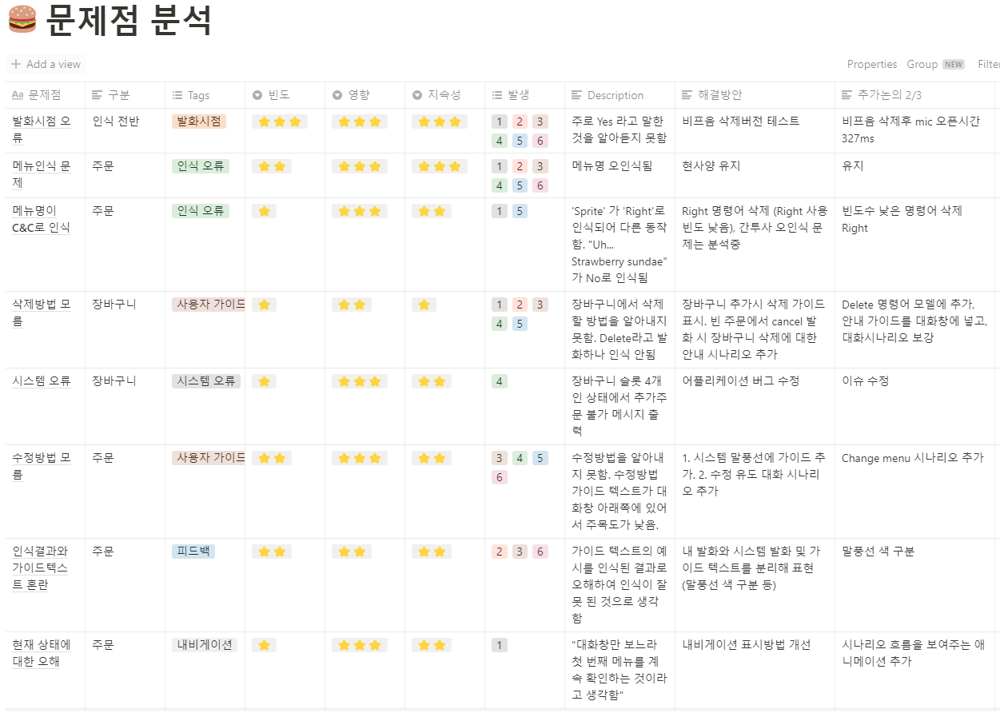

```
📅기간: 2020/06/30 ⭢ 2021/01/27
🤝고객: 미디어젠
🖥️업무: 서비스 기획, UI 디자인, 사용성 평가
🎯기여도: 50%
```

## 💡 프로젝트 목표
북미의 디스플레이 제공 업체와 드라이브스루 매장을 타겟으로 음성 주문 시스템을 개발

## 💡 접근 방법
💡 음성 인터페이스로 메뉴를 주문하는 시스템을 보여줄 수 있어야 했습니다. 인식 성능을 고려했을때는 사용 환경이 좋지는 않지만, 터치 키오스크에는 여전히 불편한 점이 있고 위생 문제가 있는 반면, 말로 주문하는 것은 터치 이전부터 해오던 자연스러운 방식라는 점은 좋은 시작점이 될 수 있다고 생각했습니다.

다양한 브랜드와 작업할 수 있도록 주문의 공통 형태가 동작하는 레퍼런스 시나리오를 만들어 보여주는 것을 목표로 했습니다.

## 💡 결과
구어와 문어의 중간정도에 위치하는 메시지앱형 UI를 만들어 어느정도 정형화된 발화를 하도록 유도했습니다. 또 대화의 진행을 시각적으로 보여줄 수 있고, 챗봇처럼 질문의 예시를 미리 제시하여 뭐라고 말해야 할지 몰라 당황하는 사용자를 도울 수 있습니다.

대화 시나리오는 디테일하게 옵션을 조정하는 것보다는 기본적인 주문을 빠르게 처리하는 것을 우선했습니다.

개발팀과 프로토타이핑을 만들어 영어 사용자를 대상으로 사용성 평가를 진행하여 인텐션을 일부 수정하고 피드백을 개선하고 재평가 프로세스를 수행했습니다. 또 참가자의 드라이브 스루 경험을 인터뷰하여 인사이트를 얻었습니다.


