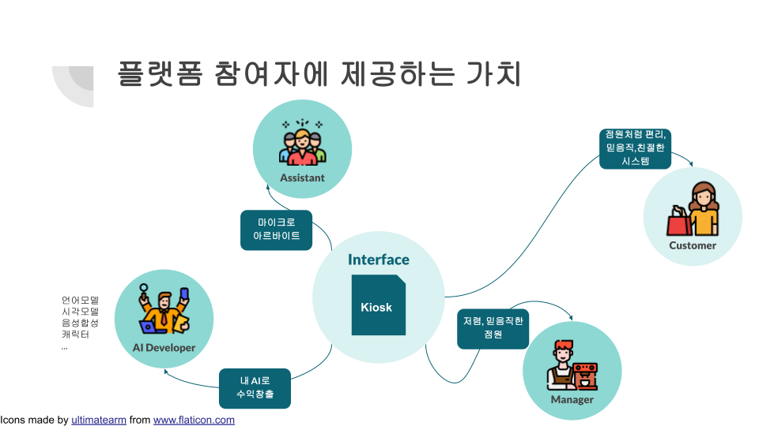
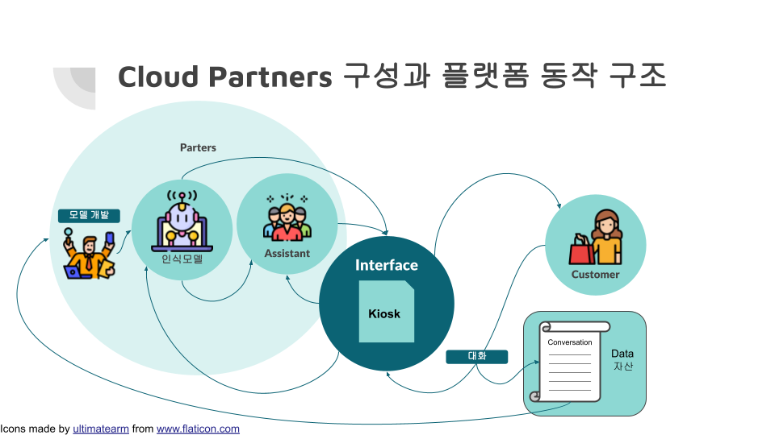

```
📅기간: 2021/02/03 ⭢ 2021/03/05
🤝고객: 미디어젠
🖥️업무: 서비스 기획
🎯기여도: 40%
```

## 💡 프로젝트 목표
음성인식 키오스크는 현재 기술적 한계로 점원 뿐만 아니라, 터치 키오스크에도 미치지 못하는 사용자 만족도를 보이는 문제점이 있습니다. 이를 문제를 해결하면서 확장 가능한 서비스를 생각해 보았습니다.

## 💡 접근 방법
`AI 키오스크는 점원을 불완전하게 대체하는 장비` 
→ `AI 키오스크는 인공지능을 고용 가능하도록 하는 플랫폼`

- 점주가 원하는 것은 AI 키오스크가 아닌 주문을 효과적으로 받는 것
- 서비스 수준을 보장하기 위해 AI 성능을 넘는 부분은 어시스턴트 활용(노이즈 상황, 기능을 넘어서는 요구)
- 이를 위해 AI와 인간이 일을 나누어 할 수 있는 공유 시스템이 필요하며
- Cloud Partners는 인공지능과 인간 어시스턴트가 모인 그룹으로 주문의 기본적인 부분을 AI 가 담당하면서 어시스턴트는 잔여 업무만 대응. 다수의 배달부가 배달 콜을 받아 수행하는 것과 비슷한 구조
- 언어 모델이 없는 언어인 경우 어시스턴트를 100%로 하여 동일하게 활용 가능하며, 이 과정에서 수집된 데이터를 활용해 언어모델 개발 기대.
- 서비스 이용 과정에서 얻어지는 데이터의 자산화, 업종별 대화셋을 보유하여 모델 개발자에게 수수료를 받고 제공하는 순환구조 제시.

## 💡 결과
- 사람 또는  다양한 AI가 응답할 수 있도록 프로토콜을 제공하는 키오스크
- 다수의 업무를 다수의 인원에게 분배하는 솔루션
- 인간과 AI의 업무가 거래될 수 있는 마켓

**응답 즉시성 확보:** 바로 응답할 수 있도록 하는 동기(보수), 선착순 크레딧 제공 등

**반응속도:** 음성인식 반응보다는 느릴 수 있으나, 주문 시스템 UI 인식결과로 서포트한다면 사람에게 주문하는것다 속도 개선 가능성 있음

**업무량의 균형:** 주문으로 발생하는 콜과 대응하는 사람의 균형. 사람이 부족하면 플랫폼의 기본 AI가 담당. 사람이 많으면, 적은 크래딧을 제공하고 응답결과의 평가 및 데이터 정제에 활용.



