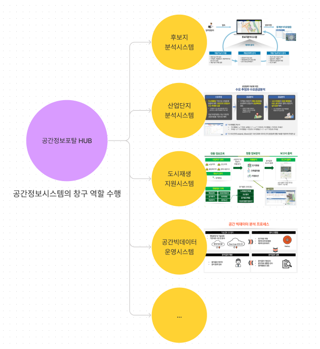
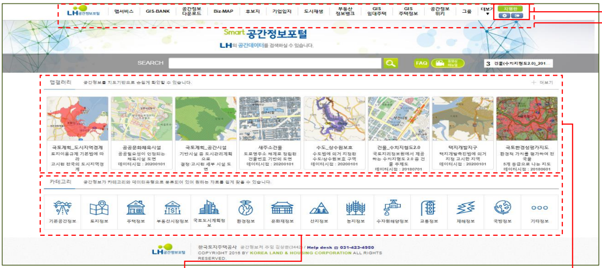
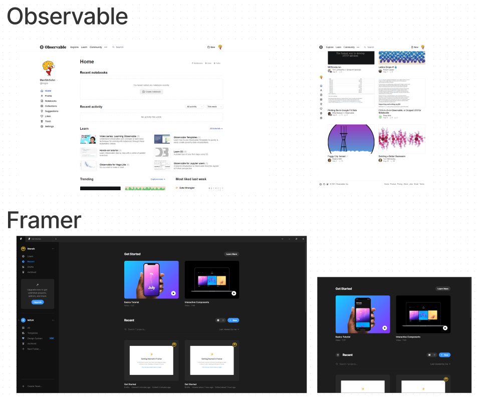
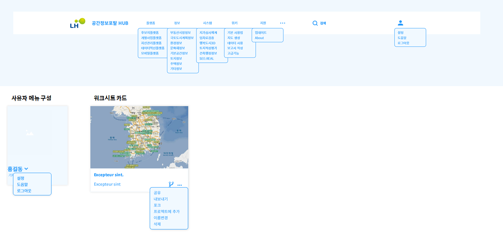
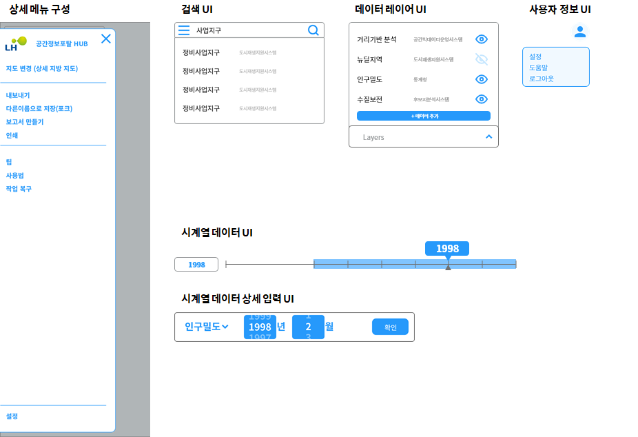

```
📅기간: 2021/09/13 ⭢ 2021/10/21
🤝고객: 국토교통부
🖥️업무: UX 디자인
🎯기여도: 60%
```

## 💡 프로젝트 목표
**요구사항:**

- **시스템 고도화 및 기능개선**
    - 시스템과 시스템 간 정보 연계필요
    - 분석 시 기능과 보고서 양식 및 결과값 보고서 등 기능개선 필요
    - 유사 시스템들의 통합과 기능 고도화 필요
- **정보에 대한 쉬운 접근성**
    - 업무에 불필요한 정보들을 최소화하고 필요한 정보 중심의 UI 설계
    - 사용자 중심의 정보와 업무 효율을 위한 수직적 사이트 구축
- **사용자 중심의 인터페이스**
    - 업무중심 전문정보를 정확하고 빠르게 인식할 수 있는 인터페이스 설계
    - 업무 사용자 위주의 사용자경험(UX)고도화 필요

## 💡 접근 방법
포털에서 관리하는 시스템들은 정보를 활용해 지도를 만들어내는 작업으로 요약할 수 있으며, 이 프로세스를 한 곳에서 통합하여 이루어지도록 할 때 업무의 효율이 향상되고, 정보의 시너지가 발생할 수 있을 것이라고 판단했습니다.

그러므로 공간정보포털은 각 시스템으로 가기 위한 관문이 아닌, 각 시스템의 정보를 모두 불러올 수 있는 작업 테이블로서 기능해야 하며, 이를 위해 각 작업물(지도)의 관리(대시보드)와 그 작업물을 만드 공간(워크스페이스)를 제공하도록 설계했습니다.

## 💡 결과
작업 테이블에 빈 지도를 놓고 각종 자료를 불러오는 컨셉을 제안했습니다. 위치 정보만을 가진 지도는 워크시트로 기능하고 이에 원하는 정보를 찾아 레이어에 더하여 지도를 만들 수 있습니다.

지도가 중심이 되기 때문에 다른 UI는 최대한 숨기도록 했습니다. 여러 정보 시스템으로 연결되는 카드들은 검색 바를 이용해 데이터에 바로 접근하도록 하였고, 그럼에도 필요한 링크들은 햄버거 메뉴로 숨겼습니다.

### 대상 분석

기존 공간정보포털은 여러 공간정보 서비스로 이동하는 링크를 제공하는 포털사이트 역할을 하고 있습니다.


각 서비스는 위치정보와 통계정보를 조합해 데이터를 보여주는 지도를 만들고 그것을 의사결정 근거로 사용해 보고서를 작성하는데 사용합니다.


기존의 포털 메인화면은 포털사이트 컨셉처럼 많은 정보를 한 화면에 보여주고 있으며, 너무 많은 것을 보여준다는 점이 제안된 개선안에서도 지적사항이었습니다.



포털에서 관리하는 시스템들은 정보를 활용해 지도를 만들어내는 작업으로 요약할 수 있으며, 이 프로세스를 한 곳에서 통합하여 이루어지도록 할 때 업무의 효율이 향상되고, 정보의 시너지가 발생할 수 있을 것이라고 판단했습니다.

그러므로 공간정보포털은 각 시스템으로 가기 위한 관문이 아닌, 각 시스템의 정보를 모두 불러올 수 있는 작업 테이블로서 기능해야 하며, 이를 위해 각 작업물(지도)의 관리(대시보드)와 그 작업물을 만드 공간(워크스페이스)를 제공해야 함.


대시보드는 최신 웹 소프트웨어에서도 활용되고 있는 구성을 활용해 메인을 대시보드로 제공합니다. 아래 예시는 Observable과 Framer인데 Google Drive, Figma 도 비슷한 구성을 활용. 이번 프로젝트에서는 데이터를 활용해 결과물을 만드는 컨셉에 맞는 [Observable](https://observablehq.com/)를 주로 참고했습니다.

워크스페이스는 작업물을 선택해 들어가 정보를 조합하는 공간이며, 기본 지도 형태를 바탕으로 하여, 위치와 데이터를 검색할 수 있는 UI를 제공해야 합니다. 고정된 정보인 위치(기본지도)를 베이스로 하여 그 위에 각종 데이터(통계자료)를 올리고, 그것을 시계열(통계 연도)로 볼 수 있도록 하는 것이 기본적으로 제공해야 할 UI가 됩니다.




초기 화면은 작업자의 결과물(지도)를 중심으로 보여주는 대시보드 역할을 합니다. 좌측은 사용자 정보와 작업 관련 메뉴를 보여주고, 상단은 시스템 관련 정보를 묶어서 보여줍니다. 업무와 거리가 먼 정보는 숨기고 드롭다운 메뉴로 볼 수 있도록 합니다.

각 작업물은 대시보드의 하위 요소로 존재하며 해당 작업물(워크시트)에 진입하면 업무에만 집중할 수 있도록 전용 UI만 보이는 페이지를 보여줍니다.


