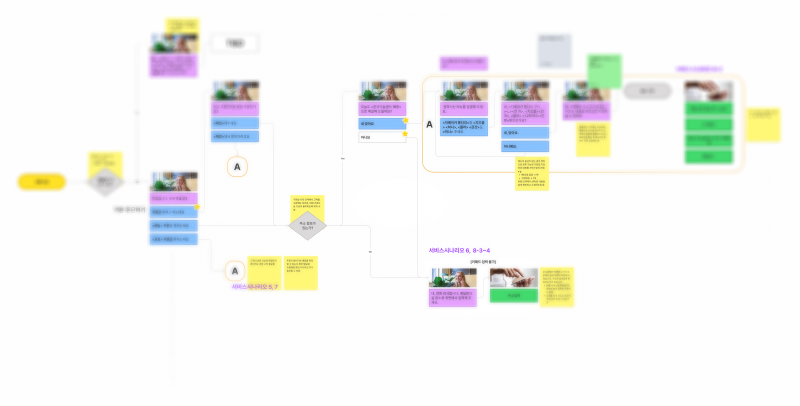

```
📅기간: 2021/10/08 ⭢ 2021/11/17
🤝고객: 더페이, 콜게이트
🖥️업무: 서비스 
🎯기여도: 40%
```

## 💡 프로젝트 목표
- 전화로 접근하는 사람을 위한 서비스 만들기
- 앱을 사용하는 사람도 전화를 쓸 수 있도록 하기
- AI가 주문처리를 일부 담당하도록 만드는것이 목표

## 💡 접근 방법
주문하기 위해서는 책자를 찾아서 전화를 거는 것이 유일했던 과거와 비교했을 때 현재는 전화 주문하는 맥락이 다릅니다. 앱 주문이 대세가 되었다고 느끼지만 아직도 전화로 주문하는 것이 50%가량 되는 곳도 있다고 합니다. 그런데 전화주문의 중요도가 떨어지고, 배달앱 주문이 업무 흐름의 중심이 되면서 소규모 사업장에서 매장으로 걸려오는 전화가 오히려 업무에 방해가 되는 요소로 작용하는 문제가 있습니다. 때문에 전화에 자동으로 응대해주는 서비스 필요성이 커지게 되었습니다.

현재 AI기술 수준으로 전화로 주문을 받는 것은 대응할 수 있지만, 주소입력과 주문 변경, 문의에 대한 응대를 포함하는 경우 복잡도가 급격히 커지게 됩니다. 주소입력과 쿠폰주문의 경우 [AI서비스 활용이 지양](https://pair.withgoogle.com/chapter/user-needs/#whats-new)되는 형태의 서비스이며 가능한 기존 주문정보를 활용하는 선에서 주문대응을 시도하는 것으로 의견을 모았습니다.

## 💡 결과
같은 주소로 재주문하는 경우를 코어 시나리오로 하고, 현재 주문된 상태인 경우 문의 시나리오, 주소정보가 필요한 경우 화면(Visual ARS)을 통해 입력하도록 안내하는 역할을 합니다.

한편 문의전화의 대부분은 배달 지연에 따른 시간 확인이기 때문에, 상태정보를 활용해 효과적으로 대응할 수 있다고 판단했습니다. 전화가 걸려왔을 때 배달중인 상태라면 현재 주문 상태에 대해 말하주는 것으로 서비스를 시작하여 자연스럽게 문의를 해결할 수 있도록 할 수 있습니다.


