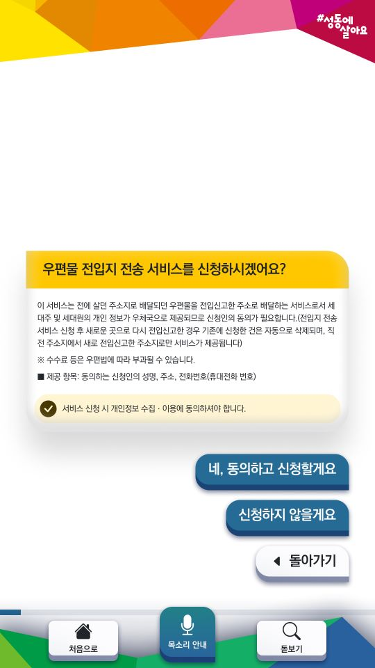
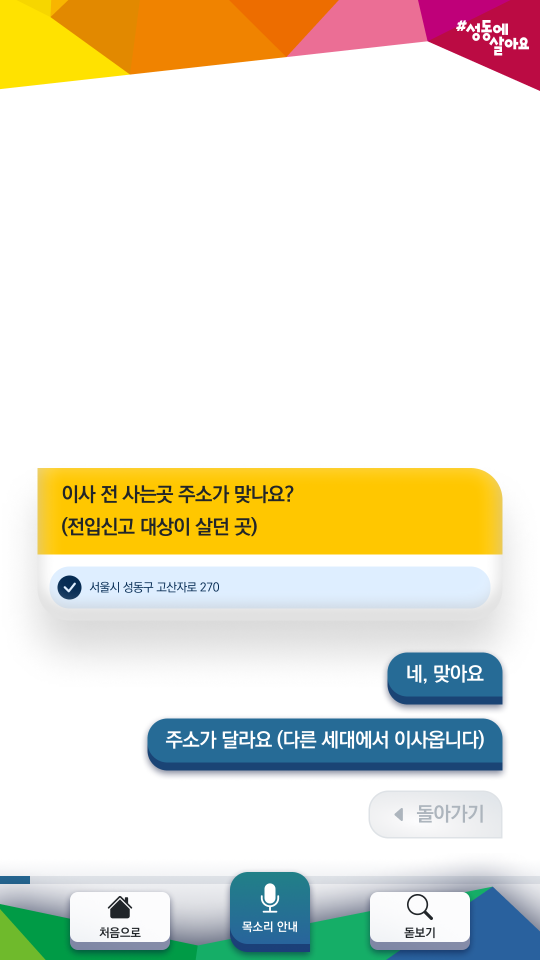

```
📅기간: 2022/07/12 ⭢ 2022/12/14
🤝고객: 성동구청
🖥️업무: UI 디자인
🎯기여도: 30%
```

## 💡 프로젝트 목표
민원서식 신청의 편리성을  향상하며, ‘장애인 차별 금지법’ 준수를 위한 배리어프리(barrier-free) 기능이 있는 민원 작성을 도와주는 키오스크 설계

요구사항:
- 시각장애인을 위한 디지털 촉지도(점자모듈), Screen-Reader 기술 적용
- 청각장애인을 위한 수어 동영상 적용
- 휠체어 사용자를 위한 하단 UI 구성(선택 버튼 하단에 위치)
- 저시력자 및 고령자를 위한 큰 글씨 UI 추가(돋보기 기능)

## 💡 접근 방법
민원서식 작성은 대부분의 사람들이 어려움을 느낍니다. 민원서식은 복수의 목적을 위해 사용되도록 만들어진 여러 입력란이 동시에 표시된 인쇄물로, 민원인의 목적에 따라 작성이 필요한 항목이 다르지만 이에따라 정보가 구분되어 표시되어있지 않기 때문입니다. 이 문제는 디지털 프로덕트인 민원서식 키오스크에서 가변적으로 필요한 정보만 제시하는 것으로 해결했습니다.

하지만 디지털 키오스크도 많은 사람들이 어려움을 느낍니다. 디지털 소외계층인 경우 학습이 필요하며, 시각장애인인 경우 터치 디스플레이를 사용하기 어렵습니다. 이는 대화형 UX 디자인과 하드웨어 설계로 해결했습니다.

## 💡 결과
학습하지 않고 쓸 수 있는 키오스크를 만들기 위해 가장 익숙한 UI를 제공할 방법을 고민했습니다. 모두에게 가장 익숙한 인터페이스는 ‘대화’입니다. 그리고 대화를 하는 UI는 메신저 입니다. 국민 대부분이 메신저를 사용에 익숙하며 이는 고령층에게도 유효합니다 (2021년 서울시민 디지털역량실태조사, 2022)

대화형 UI는 익숙다는 장점 외에더 시각 또는 청각만 사용하더라도 동일한 사용자 플로우를 따르도록 할 수 있는 장점이 있습니다. 사용자 특성에 관계없이 비슷한 경험을 제공할 수 있고 개발분량을 최적화할 수 있는 장점이 있습니다. 위에서 아래로 흐르는 시선 방향은 사용을 쉽게 하기도 하지만 스크린리더를 적용하는 것만으로 대화가 되도록 할 수 있습니다.

민원서식에서 중요한 부분만 모아 보여준다고 해도 여전히 어렵습니다. 사용자의 인지부하를 최소화하기 위해 한 페이지에 하나의 질문만을 주고, 선택지를 제공하는 방식으로 진행하도록 했습니다. 민원인이 친절한 공무원에게 메신저로 작성을 도움받는다는 느낌을 받기를 기대했습니다.

조작을 위한 UI는 반드시 화면 하단에 위치하도록 하여, 위에서 화면을 읽고 아래서 답한다는 간단한 규칙을 전달함과 동시에 신장이 작서나 휠체어를 사용하는 민원인이 조작에 어려움을 겪지 않도록 했습니다.





