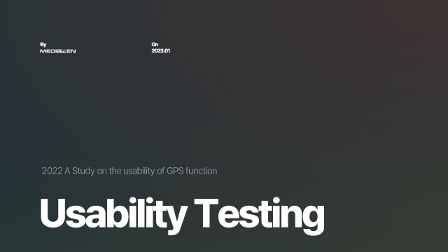
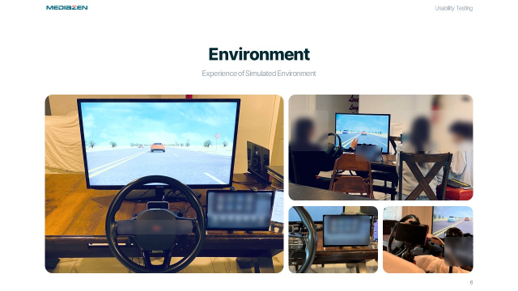
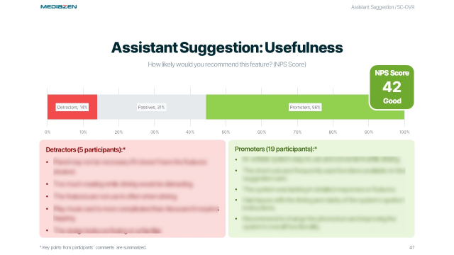
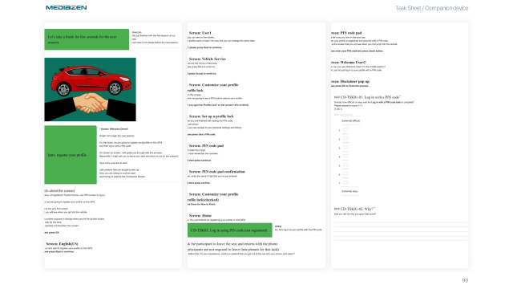

```
📅기간: 2022-12-07 ⭢ 2023-01-31
🤝고객: Honda
🖥️업무: UX 리서치
🎯기여도: 30%
```

## 💡 프로젝트 목표
제안 기능
- 신규 레이아웃의 가독성과 조작성을 비교
- 권장 콘텐츠 업데이트로 인해 발생하는 불편 사항을 확인
- 신규 Card 기능의 명확성과 효율성을 평가

연결 기능
1. PIN 코드가 있을 때와 없을 때의 로그인 사용성을 비교
2. 차량과 스마트폰에서 디바이스를 등록하고 연결되어 있는 것을 확인할 수 있는지 확인
3. 차량에서 메시지 수신의 유용성을 평가
4. 캘린더 기능에서 전화 및 목적지 정보에 대한 액세스의 유용성을 평가

## 💡 접근 방법
태블릿과 주행 시뮬레이터를 사용한 WOZ테스트

평가는 두 가지 지표를 사용
- SEQ는 사용성 전반에 대해 알 수 있는 질문으로, 작업의 난이도에 대해 질문하지만 사용성의 모든 요소(효과성, 효율성, 만족도)에 상관관계가 있는 효율적인 점수
- NPS: 고객의 충성도를 나타내는 점수로 서비스가 시장에서 받아들여질 수 있을지 추측

## 💡 결과
신규 기능 1
- 카드 유형 선택: 유형 A 레이아웃을 선택하는 것이 합리적
- 운전 방해: 제안 카드 섹션의 업데이트가 운전을 방해하지 않았음
- 카드의 전달 : 각 레이아웃의 큰 차이 없이 카드의 의미나 구성에 대한 문장을 정확하게 전달함
    - 행위를 다르게 예측한 참여자들은 대부분 세부 추가 행위에 대해 오해를 하고 있음
    - 다만, 사용에 지장을 줄 수 있는 요소는 개선 권장.
신규 기능 2
- 대부분의 참가자는 Companion Device가 충분히 가치가 있다고 생각함.
- 하지만 PIN 연결 방식도 충분히 쉬웠기 때문에 전환에 대한 압력이 부족할 수 있음
- 운전 중 메시지 표시는 큰 장애는 아니지만 운전에 방해가 되는 요소가 있는 것으로 판단됨
- 전화를 걸거나 내비게이션 기능이 있는 캘린더 기능이 유용하다고 생각함

### 보고서 샘플

#### 테스트 환경 구성

#### 사용자 시나리오 분석

#### 지표와 인터뷰 분석

#### 인터뷰 시트
