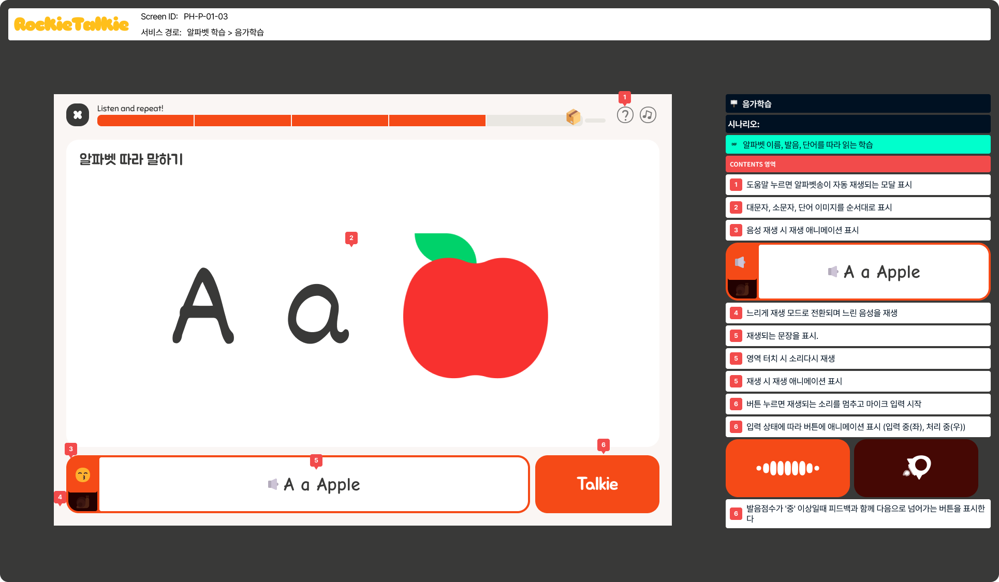
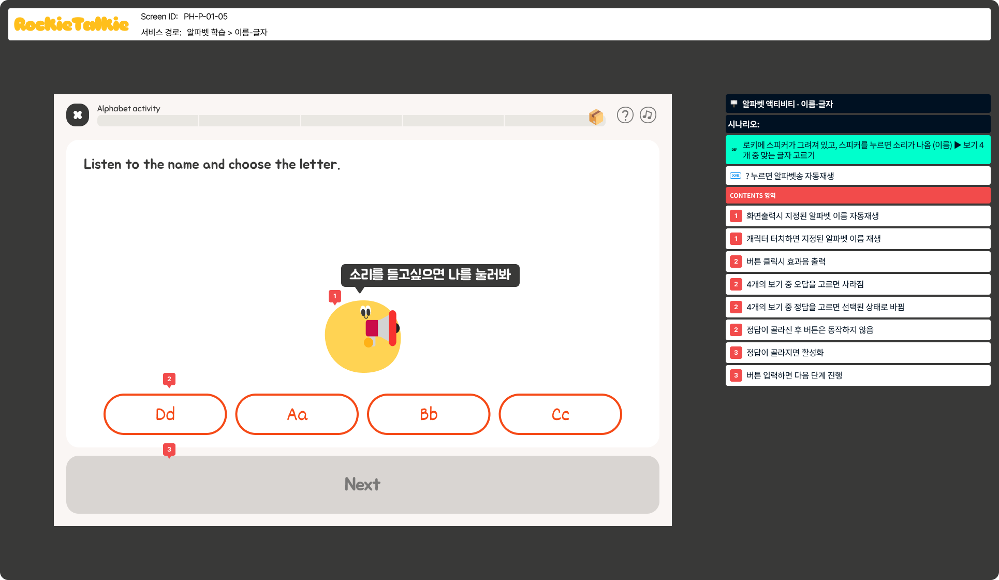
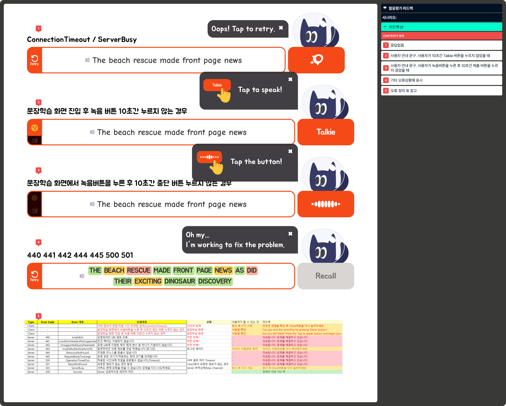
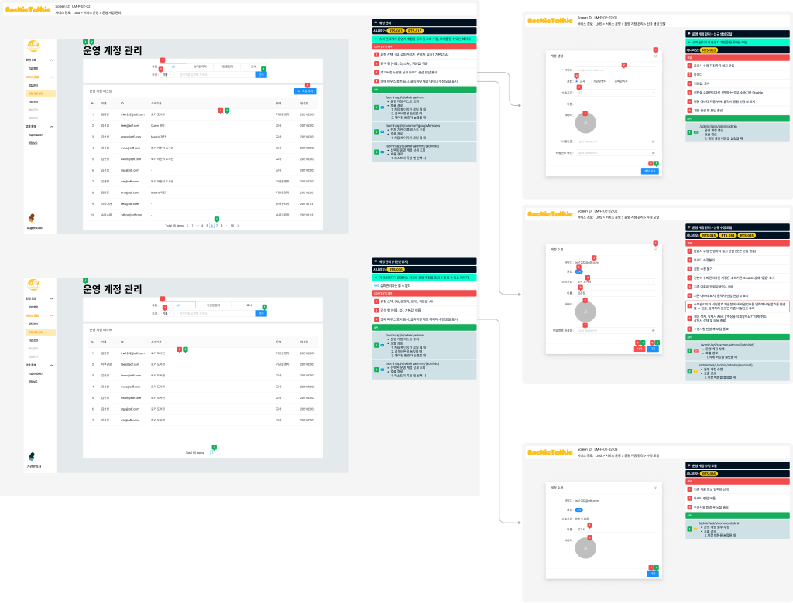
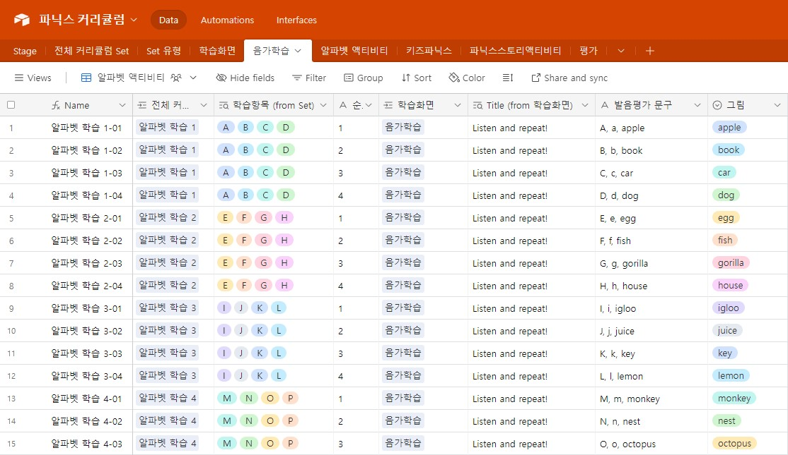

```
📅기간: 2023/02/01 ⭢ 현재
🤝고객: 지자체 및 도서관
🖥️업무: UI 디자인 ⭢ 프로덕트 오너
🎯기여도: 50%
```

## 💡 프로젝트 목표
AI 발음평가 기술을 활용하여 도서관과 함께 온-오프라인 믹스로 진행되는 B2G 영어교육 서비스 출시

## 💡 접근 방법
어린이가 꾸준히 영어학습을 이어나가도록 하는 것이 프로젝트의 중요한 목표였습니다.이를 위해 영어를 배우는 것 자체가 성장이 되는 것을 컨셉으로 게임화 전략을 도입했습니다. 이에 맞춰 스토리라인을 설계하고 UI를 디자인했습니다.

현재 시장에는 화려한 기능과 방대한 콘텐츠를 자랑하는 영어교육 서비스가 넘쳐나지만, 대부분의 학생들은 실질적인 지원이 부족한 상태입니다. 학부모는 전문적이고 체계적인 교육을 제공하는 데 어려움을 겪고, 지자체나 공공기관은 이러한 학생들에게 더 많은 관심과 지원을 기울여야 합니다. 영어 교육의 핵심은 꾸준한 언어 노출을 통해 자연스럽게 학습하는 데 있습니다. 미국 국립읽기위원회(NRP)의 발달 단계에 따르면 음소 인지를 시작으로 하여 파닉스, 읽기 유창성, 어휘력을 갖추고 내용 이해에 이른다는 과정을 제시합니다. 아이가 책에 흥미를 놓치지 않도록 하고, 제대로 듣고 읽기에 집중할 수 있도록 하면 목표를 달성할 수 있을 것입니다.


## 💡 결과
릴리즈 준비중입니다.

[👉프로젝트 회고: 무너지는 팀에서 결과 만들어내기 1/2](/blog/2024-03-18-프로젝트-회고-1)

### 알파테스트에서 받은 피드백들
>발음된 단어의 정확도를 색으로 쉽게 구별할 수 있어 부족한부분을 신경써서 다시 해볼수 있어서 너무 좋아요 

>단기간에 로키토키로 책을 읽으면서, 제 아이의 발음이 향상되는 것을 제가 듣고, 느꼈습니다. 그 부분이 제겐 큰 보람입니다. 감사합니다!!!

>여러번 반복해 녹음하면서 억양이나 발음이 점점 좋아지는 것을 느꼈고, 강점과 약점도 상세하게 분석되는 것이 굉장히 만족스럽습니다. 

>아이가 최근들어 친구들과의 격차때문인지 영어에 부담을 표현하는 횟수가 많아 걱정이었는데 이번 기회에 마음의 장벽을 많이 낮춘거 같아 좋습니다.










