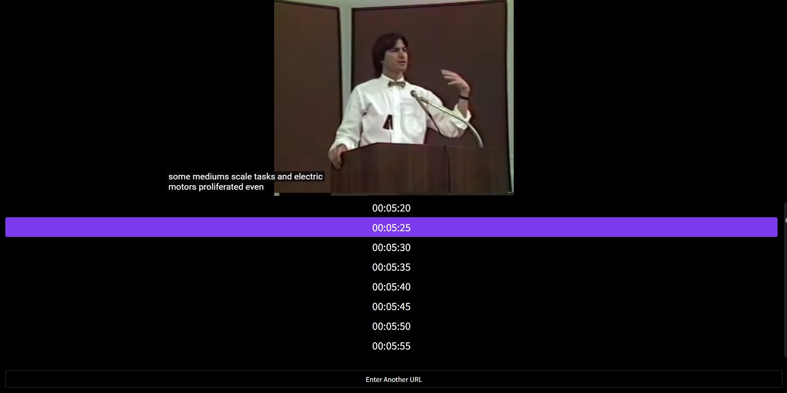

```
📅기간: 2024/07/24 ⭢ 2024/08/04
🖥️역할: 프로덕트 디자이너
🎯기여도: 100% (with GPT4o)
```

## 💡 접근 방법
요즘 많은 정보가 유튜브 영상으로 올라오는 걸 보면 답답함을 느낍니다. 적어도 블로그 글이었다면 빠르게 훑어보고 필요한 정보를 찾거나, 별로 유용하지 않다는 걸 금방 알 수 있었을 텐데 말이죠. 영상은 재생 버튼을 누르고 기다려야 하고, 중요한 부분을 지나쳤다 싶으면 다시 돌아가서 또 기다려야 합니다.

마우스에 휠이 처음 써보았을 때가 생각났어요. 그때의 놀라움이 아직도 생생합니다. 여태까지 휠 없이 살았다니. 근데 유튜브로 와서는 다시 그 속도감과 자유를 느끼기 어렵게 되었습니다. 적어도 정보를 찾기 위해 유튜브를 봐야 한다면 시간축은 스크롤로 조작할 수 있어야 합니다.

그래서 제가 디자이너, GPT4o를 개발자 역할을 하도록 하여 배포까지 완료했습니다.
저녁시간에 조금씩 개발해 10일정도 걸렸고, 배포는 Vercel을 이용했습니다.

## 💡 결과
ZoetroView는 PC에서 마우스 스크롤로 유튜브 영상을 빠르게 훑어볼 수 있도록 하는 뷰어입니다. 크라운 기어가 기계의 회전 축을 바꾸는 것처럼 ZoetroView는 YouTube의 수평 타임라인을 수직 스크롤로 변환하는 크라운 기어라고 생각할 수 있습니다. 이제 마우스 휠로 YouTube 동영상을 탐색하여 정보를 더 빠르고 직관적으로 찾을 수 있습니다.

[](https://zoetroview.vercel.app/)

[](https://zoetroview.vercel.app/n8Q7gXwavUU)

<a href="https://www.producthunt.com/posts/zoetroview?embed=true&utm_source=badge-featured&utm_medium=badge&utm_souce=badge-zoetroview" target="_blank"></a>


