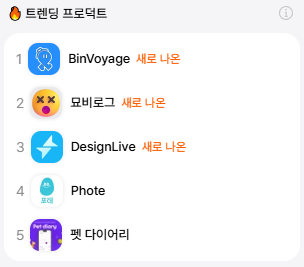
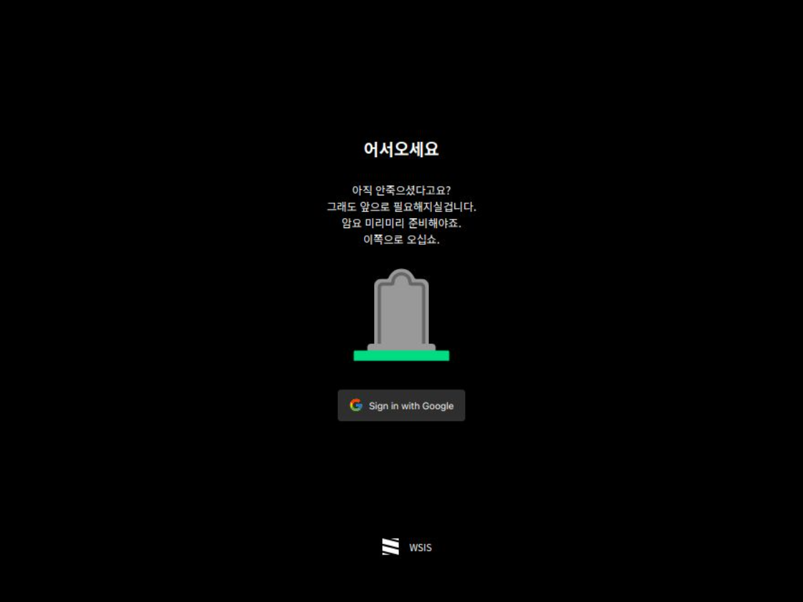

```
📅기간: 2024/07/24 ⭢ 2024/08/04
🖥️역할: 프로덕트 디자이너
🎯기여도: 100% (with GPT4o)
```

## 💡 접근 방법
죽음을 생각하는건 터부시되지만, 자신의 일생을 미리 부고로 작성하는 것은 현재와 미래를 성찰하는 유용한 방법이라고도 합니다. 미래 시제로 자신의 이야기를 써보면 우울해지지 않고도 부고를 쓸 수 있지요.
백앤드를 MongoDB로 만드려보다 실패해서 묵혀두던 프로젝트를 Supabase를 사용해 살려본 작업입니다.
온보딩 과정은 나와 죽은 나를 분리하는 과정을 거치도록 합니다. 로그인 직후 지연된 애니메이션을 보여주면서 까만 화면을 의도적으로 보여주는데 스마트폰 디스플레이의 물리적인 질감을 이용해 사용자의 얼굴이 영정 사진처럼 비치도록 하는 연출입니다. 띠를 둘러 직접적으로 나타내기보다는 나중에 알려주면 깨닳을 수 있도록 했습니다.

## 💡 결과
묘비명을 새기고 공유하는 앱입니다. 웹에 링크로 남아있는 업적을 기록해둘수도 있지요.
죽

[](https://tombstone.vercel.app/)

[](https://disquiet.io/product/%EB%AC%98%EB%B9%84%EB%A1%9C%EA%B7%B8)



